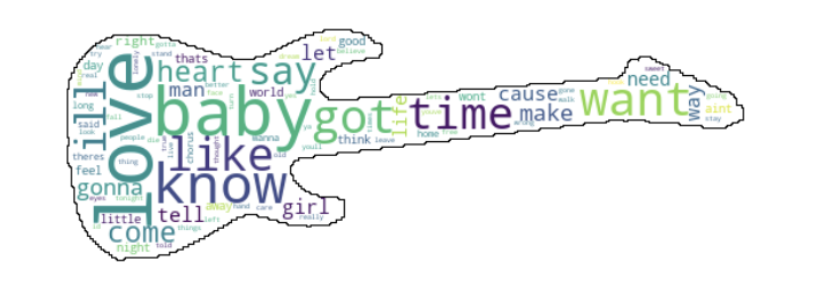

# Why I Love R&B Lyrics: R&B Lyrics Analysis

This project explores **R&B lyrics** through various natural language processing (NLP) techniques to uncover the emotional depth, narrative structures, and language usage that make this genre stand out. The analysis includes **sentiment analysis**, **topic modeling**, and **network visualizations**. For comparison, we also examine the lyrics of **Metal music** to highlight the unique characteristics of R&B lyrics.

## Table of Contents
- [Introduction](#introduction)
- [Dataset](#dataset)
- [Objectives](#objectives)
- [Analysis Techniques](#analysis-techniques)
  - [1. Word Frequency & Word Cloud](#1-word-frequency--word-cloud)
  - [2. Topic Modeling](#2-topic-modeling)
  - [3. Sentiment Analysis](#3-sentiment-analysis)
  - [4. Pronoun Usage](#4-pronoun-usage)
  - [5. Word Network Analysis](#5-word-network-analysis)
- [Comparison with Metal Lyrics](#comparison-with-metal-lyrics)
- [Results](#results)

## Introduction
The goal of this project is to examine why **R&B lyrics** resonate emotionally with listeners. By analyzing common themes, emotional expressions, language usage, and narrative structures, we can gain insights into what makes R&B lyrics unique and powerful. The project also includes a comparative analysis with **Metal** lyrics to highlight the differences in emotional tone and linguistic structure.

## Dataset
The dataset includes:
- **R&B Lyrics**: A collection of cleaned R&B song lyrics.
- **Metal Lyrics**: Lyrics from Metal songs to provide a comparison point.

## Objectives
1. **Analyze emotional tone**: Evaluate the positive and negative emotions expressed in R&B lyrics.
2. **Explore linguistic features**: Analyze word frequency, sentence structure, and pronoun usage.
3. **Topic Modeling**: Identify key themes in R&B songs.
4. **Network Analysis**: Create a word network to visualize the relationships between key words.
5. **Comparison with Metal**: Compare R&B lyrics with Metal lyrics to understand genre differences.

## Analysis Techniques

### 1. Word Frequency & Word Cloud
Word frequency analysis highlights the most commonly used words in R&B lyrics. Below is a **word cloud** shaped like a guitar that visually represents the most frequent words, where larger words appear more frequently.

Key takeaways:
- **"Love"**, **"baby"**, and **"know"** are the most dominant words in R&B lyrics, showing the genre's focus on love and emotions.

### 2. Topic Modeling
We used **Latent Dirichlet Allocation (LDA)** to perform topic modeling on R&B lyrics. Below are the top three topics that emerged from the analysis, showing the most common words associated with each topic.

Each bar chart represents a different topic, with key words that frequently appear within those topics:
- **Topic 1**: Focuses on emotions and relationships (e.g., **love**, **baby**, **time**).
- **Topic 2**: Includes words related to life experiences (e.g., **life**, **know**, **man**).
- **Topic 3**: More situational or setting-based terms (e.g., **world**, **night**, **home**).

### 3. Sentiment Analysis
R&B lyrics are generally positive in tone but also contain a range of emotions, including sadness and trust. Using **TextBlob**, we analyzed the proportion of different emotions, which is visualized in the **Emotional Radar Chart** below.

#### Emotional Radar Chart for R&B

This chart reveals that **positive emotions** and **joy** are dominant in R&B lyrics, but there is also a notable expression of **sadness** and **trust**.

### 4. Pronoun Usage
Pronoun usage helps highlight the intimacy of R&B lyrics. The chart below compares **first-person** and **second-person** pronoun usage in R&B lyrics, showing a high degree of personal narrative. 

#### First vs. Second Person Pronoun Usage

R&B frequently uses both **first-person** pronouns ("I", "me", "my") and **second-person** pronouns ("you", "your"), reflecting the genre's personal and conversational tone.

### 5. Word Network Analysis
To further explore word associations, we constructed a **word network** using bigrams (pairs of consecutive words) found in R&B lyrics. This network helps visualize the most frequently connected words and their relationships.

#### Simplified Bigram Word Network

The network shows that words like **"love"**, **"baby"**, and **"know"** are central in R&B lyrics, often serving as bridges to other emotional or situational words. These connections highlight R&B's focus on personal and emotional themes.

## Comparison with Metal Lyrics
For contrast, we also analyzed **Metal lyrics** using the same techniques. The **Emotional Radar Chart** below compares the emotional expressions in R&B and Metal lyrics.

#### R&B vs Metal: Emotional Radar Chart

Key observations:
- **R&B** is more focused on **positive emotions** such as joy, trust, and anticipation.
- **Metal**, on the other hand, shows higher expressions of **anger**, **disgust**, and **fear**, aligning with its themes of rebellion and dark emotions.

#### Simplified Bigram Word Network: Metal Lyrics

Compared to R&B, Metal lyrics are dominated by words like **"war"**, **"kill"**, **"blood"**, and **"fight"**, reflecting more aggressive and confrontational themes.

#### Degree & Eigenvector Centrality in R&B

Finally, we used **Degree Centrality** and **Eigenvector Centrality** to identify the most influential words in R&B lyrics. Below is a filtered word network showing the most central words.

![Degree & Eigenvector Centrality][fig9.png)

Words like **"baby"**, **"love"**, and **"know"** are not only frequently used but also connect to many other key terms, underscoring their centrality in the emotional expression of R&B.

## Visualizations
The visualizations above provide a deep dive into the emotional and linguistic features of R&B lyrics, illustrating how R&B emphasizes love, personal relationships, and positive emotions, while Metal music focuses more on darker, aggressive themes.

## Results
- **Sentiment Analysis**: R&B lyrics express more positive emotions, focusing on love, joy, and trust.
- **Keyword Network**: Words like **love**, **baby**, and **know** are central, connected to many other emotional terms.
- **Topic Modeling**: Themes of love, relationships, and personal experiences dominate R&B lyrics.
- **Comparison with Metal**: R&B's focus on emotions and intimacy contrasts sharply with Metal's darker, aggressive themes.

